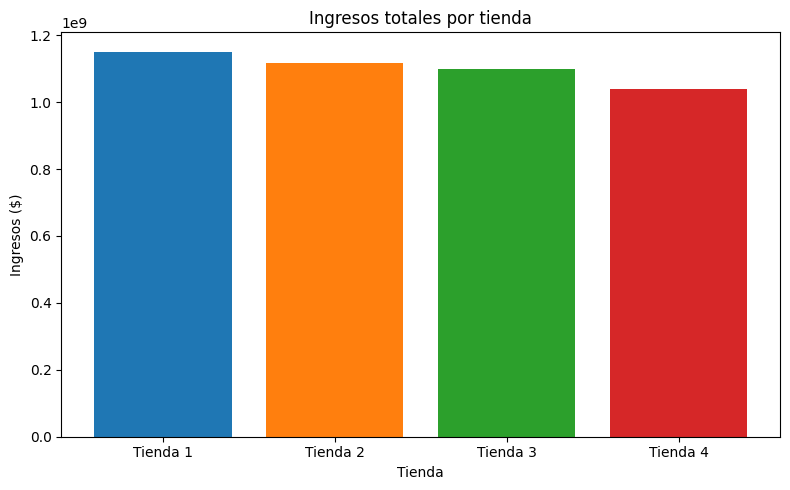

# AluraStoreLatam_DataScienceChallenge1
Es un desafío para practicar el análisis de base de datos para un caso en particular en donde se debe asistir al Sr. Juan a decidir qué tienda de su cadena Alura Store debe vender para iniciar un nuevo emprendimiento.

## Ejemplos de gráficos e insights obtenidos

- **Gráfico de columna** para visualizar los ingresos totales por tienda.
  
  
  
- **Gráfico de línea** para comparar calificaciones promedio.
  
  
  
- **Gráfico de tortas** para comparar las categorías de producto.
  
  
  
- **Gráfico de barras** para comparar los productos más/menos vendidos.
  
    

**Insight destacado**: La Tienda 3 posee el mejor balance entre ventas, satisfacción del cliente y liderazgo en categorías clave.

## Herramientas utilizadas

- Python 3  
- Google Colab

## Bibliotecas utilizadas
- Pandas  
- Matplotlib  
  

## Instrucciones para ejecutar el proyecto

1. Abre el archivo `AluraStoreLatam.ipynb` en [Google Colab](https://colab.research.google.com/) o tu entorno local de Jupyter Notebook.
2. Asegúrate de tener los archivos necesarios cargados si usas una carpeta `/data/`.
3. Ejecuta cada celda en orden para reproducir el análisis y visualizar los resultados.
4. Al final del notebook encontrarás la conclusión con la tienda recomendada y su respectiva justificación.

## Recomendación final

La **Tienda 3** es la opción más favorable, gracias a:

- Mayor satisfacción del cliente (calificación promedio más alta)  
- Buen rendimiento en categorías clave (Electrónicos y Muebles)  
- Equilibrio entre volumen de ventas y tipo de productos ofrecidos

## Notas

Este proyecto es parte del curso de Data Science de Alura Latam. Los resultados se basan exclusivamente en los datos proporcionados.
